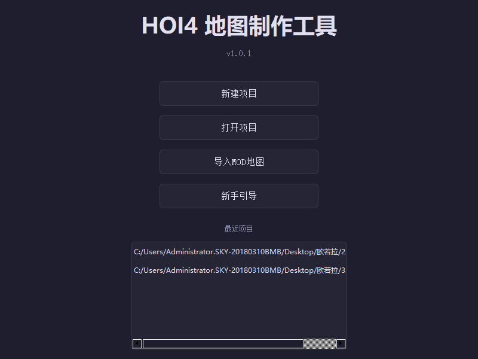
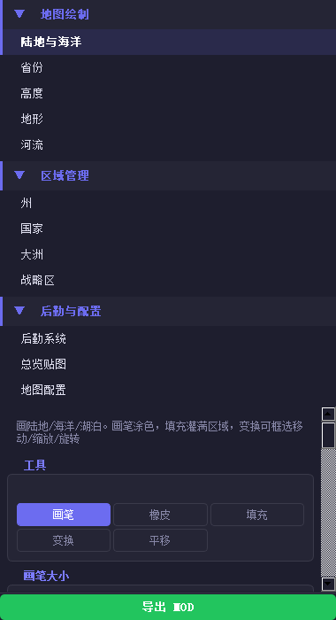
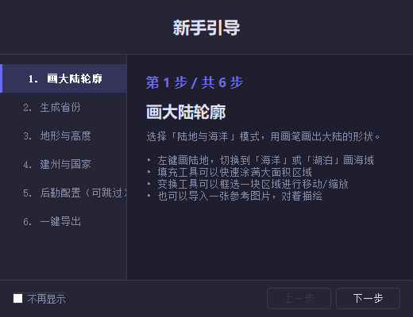

[English](README.md) | [中文](README.zh-CN.md)

# HOI4 Map Maker

**Build a complete Hearts of Iron IV total conversion MOD from scratch — no manual file editing required.**

HOI4 Map Maker is an open-source desktop map editor built with Python and PyQt5. It provides 12 editing modes covering the entire map creation workflow: draw continents, generate provinces, assign states and countries, and export 2000+ game files with one click. Launch HOI4 and play immediately.

> **Current Version**: v1.0.1 &nbsp;|&nbsp; **Tech Stack**: Python 3.10 · PyQt5 · NumPy &nbsp;|&nbsp; **Platform**: Windows


### Screenshots

**Welcome Page** — create, open, import, or learn with the built-in guide:

<p align="center">
  
</p>

**Tool Panel** — 12 editing modes with grouped navigation:

<p align="center">
  
</p>

**Getting Started Guide** — step-by-step workflow walkthrough on first launch:

<p align="center">
  
</p>

**Mode Hint Bar** — contextual tips on first use of each editing mode:

<p align="center">
  
</p>

---

## Features

### Map Drawing
- **Land / Sea / Lake** brush with brush, eraser, fill, transform, and pan tools
- Load vanilla map reference overlay or custom reference images
- 4 map sizes: 2048×1024 / 3072×1536 / 4096×2048 / 5632×2048

### Province System
- Voronoi + Lloyd relaxation auto-generation with adjustable density (separate sea/lake density)
- **Merge** / **Split** / **Lasso expand** tools for fine-tuning borders
- Incremental regeneration (select a region to regenerate)
- Full-map diagnostics: X-crossings, tiny provinces, disconnected regions, coastal detection

### Terrain / Height / Rivers
- 10 terrain brushes: plains, forest, hills, mountains, desert, marsh, jungle, urban, ocean, lakes
- Smart terrain generation (height-based layering + noise boundaries + scatter patches)
- Smart heightmap generation (coastal distance field + Perlin noise mountains + smoothing)
- River drawing with 12 types following HOI4's strict color palette

### States / Countries / Regions
- Auto-generate states from provinces with population, category, and victory points
- Create countries with TAG, color, ruling party, and capital
- Continent assignment and strategic region management
- Logistics: adjacencies, railways, supply nodes
- **Quick Init**: one-click generation of states + strategic regions + default country

### One-Click Export
- Generates 2000+ HOI4 files: `provinces.bmp`, `definition.csv`, `heightmap.bmp`, `terrain.bmp`, `rivers.bmp`, state histories, country definitions, `buildings.txt`, supply networks, and more
- Pre-export validation with auto-fix for missing data
- Smart `replace_path` generation to avoid vanilla conflicts
- Export and launch — ready to play

### Project Management
- Save / load `.hoi4proj` project files (zip format)
- Undo / redo with Command pattern (30-step history)
- Chinese / English bilingual UI
- Import existing MOD maps

---

## Quick Start

### From Source

```bash
git clone https://github.com/AmonStreeling/hoi4-mod-maker.git
cd hoi4-mod-maker
pip install -r requirements.txt
python main.py
```

### Packaged Release

Download the latest `.zip` from [Releases](https://github.com/AmonStreeling/hoi4-mod-maker/releases), extract, and run `HOI4MapMaker.exe`.

### Requirements

- Python 3.10+ (source only)
- Windows 10/11
- Dependencies: PyQt5, NumPy, Pillow, SciPy

---

## Architecture

```
hoi4_map_maker/          224 files, 26,000 lines
├── model/               Data center (Project + EventBus)
├── domain/              Pure data layer (MapData + 8 Managers + generators)
├── commands/            Command pattern undo/redo (25 commands)
├── controllers/         13 business controllers (zero Qt dependency)
├── views/               Main window + canvas (input routing + overlays)
├── ui/                  Tool panel + dark theme + i18n
├── features/            12 map editing modes + 10 content modules (v2.0)
├── services/            Export / import / project services
├── export/              MOD exporter (writers organized by HOI4 directory)
├── data/                Constants + terrain definitions
├── app/                 DI container + feature registry
└── tests/               pytest test suite
```

**Pattern**: MVC + Command + EventBus

**Data flow**: User input → InputRouter → Controller → Command → MapData/Manager → EventBus → Feature renderer → Canvas refresh

---

## Roadmap

### v1.0 — Map Editor ✅
- [x] Land / province / terrain / height / river editing
- [x] State / country / continent / strategic region management
- [x] Logistics (adjacencies / railways / supply nodes)
- [x] One-click export of playable MOD
- [x] Import existing MOD maps
- [x] Chinese / English bilingual UI
- [x] Packaged `.exe` release

### v2.0 — Content Editor (Planned)
- [ ] Technology / focus tree editor
- [ ] Advisor / general / spy system
- [ ] Order of battle (OOB) editor
- [ ] Event / decision editor
- [ ] Ideas / namelist / portraits

---

## License

This project is licensed under the **GNU General Public License v3.0**.

- You may freely use, modify, and distribute this software
- MODs created with this tool are **not** subject to GPL
- Modified versions of the tool itself must be open-sourced under GPL
- See [LICENSE](LICENSE) for details

---

## Contributing

Issues and pull requests are welcome.

Code conventions:
- Chinese comments
- `snake_case` functions / `CamelCase` classes
- Files under 800 lines
- NumPy vectorization — no Python loops for pixel operations
